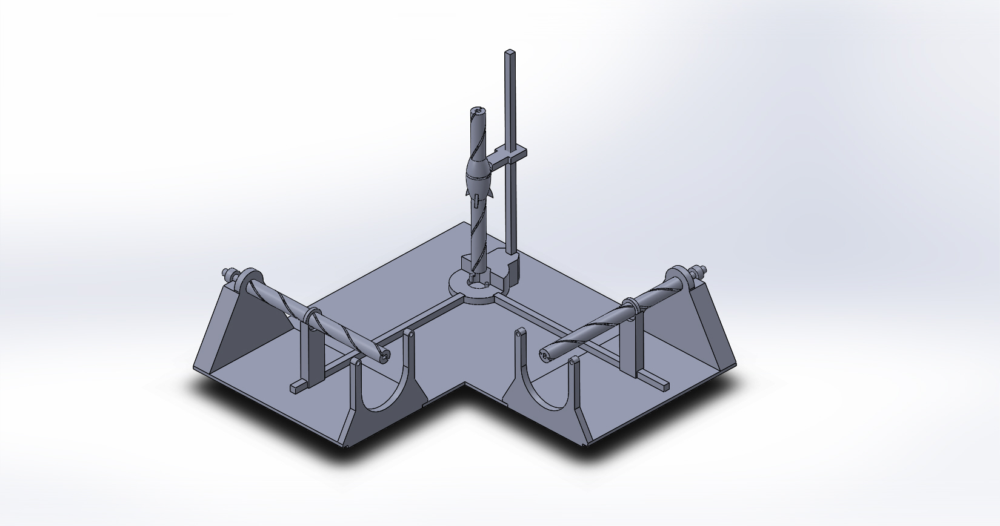
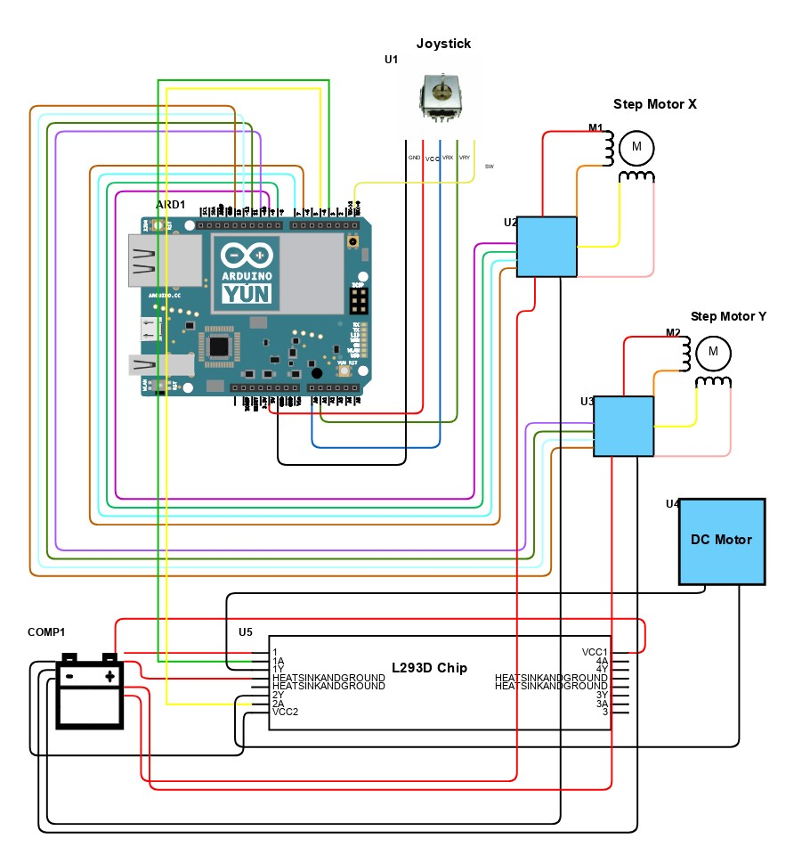

# ArduinoProject_3_Axis_Motion

## Final Project: 3-Axis Mechanism

  The project I chose to work on for this assignment was a machine that could move along three axes.  The mechanism I decided to use (that did not turn out, as I did not give myself enough time to make sure that the 3D printing methods that were used would turn out well), is as follows: 
  
  ### <ins>Mechanics</ins>
  
  
  
  Two stepper motors were to be placed at the origin, and a DC motor was to be placed on the z-axis, which is holding the small model rocket that can be seen above.  The thicker axes which the motors run along have a helix pattern cut out of them, along which the rings ride, translating the rotational motion of the motors into cartesian motion on the axes.  The axes allow 6 inches of free movement in all three directions.
  
  ### <ins>Electronic</ins>
  
  The three motors are controlled by a joystick.  The x-axis controls the 1st stepper motor, the y-axis controls the second, and the switch controls the z-axis.  The z-axis goes up while the button is pressed, and goes down while not pressed.  The schematic of the electronics is as follows:
  
  
  
  
  The stepper motors each have four pins connected to the Arduino, and are connected to +5V and GND of the power source.  Stepper X is connected to pins 6, 7, 8, and 9.  Stepper Y is connected to 10, 11, 12, and 13.  The DC motor is connected to pins 3 and 4 on the Arduino board.  It is connected via the L293D chip, as demonstrated in class.  The joystick is connected to analog pins A0 (for x) and A1 (for y), and digital pin 0 on the Arduino.  The code for this mechanism is located in the PHYS3500_FinalProject.ino file.
  
